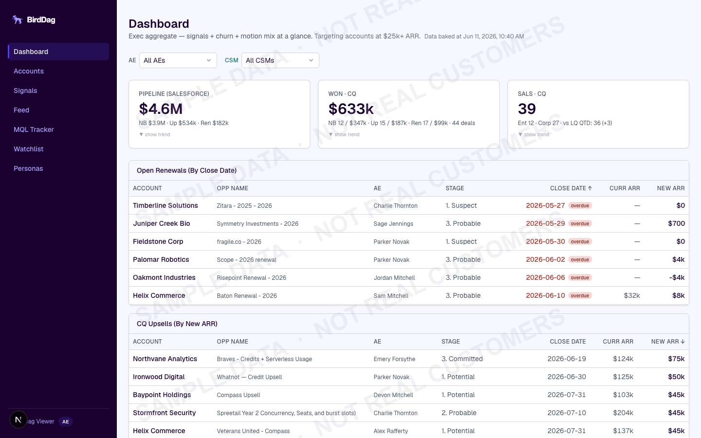
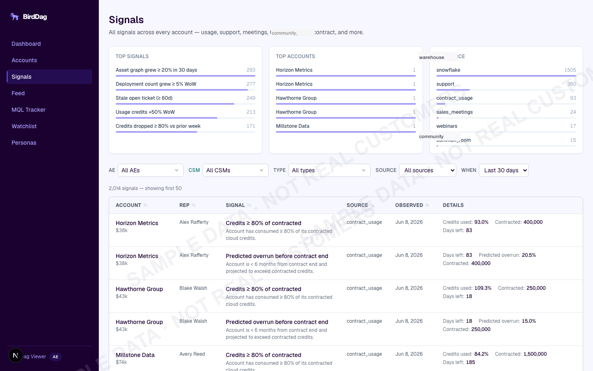
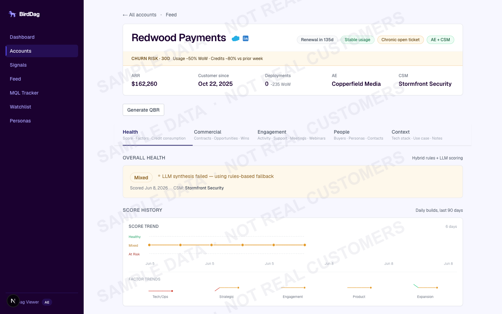

# Revenue Intelligence Platform — Case Study

Full-stack customer signal detection system that tells a sales team which accounts to call, why, and what to say.

**Case Study:** [mikegrowsgreens.com/work/bird-dag](https://mikegrowsgreens.com/work/bird-dag)

## What It Does

- 30+ signal types evaluated across every active account on multi-cadence schedules (hourly data refresh, periodic LLM scoring)
- LLM expansion scoring with token budgets ($0.08 per scoring run for full book of business)
- Composite health scores with hard-override circuit breakers
- Persona/buying committee analysis from CRM + community data
- Monday Slack DMs to each AE with priority accounts and talking points
- One-click QBR generation with shareable links and PDF export

## Architecture

All expensive computation (warehouse queries, LLM calls, health scoring) runs at build time across multiple bake cadences — hourly for core data, daily/weekly for LLM scoring and persona analysis. Output goes to object storage. The Next.js app reads cached results at runtime. Pages load fast, cost is fixed and predictable.

## Stack

| Layer | Detail |
|---|---|
| Frontend | Next.js, React, TypeScript (strict), Tailwind, Recharts |
| Backend | Next.js API routes, ORM, PostgreSQL, object storage with ISR |
| Pipeline | Custom TypeScript ETL, data warehouse SDK, 50+ warehouse queries across 30 data modules |
| AI | LLM API with cloud provider fallback, token budgets, prompt caching |
| Infra | Docker multi-stage, managed Kubernetes, GitOps, zero-trust networking |
| Testing | Vitest, 580+ tests, in-memory DB for integration tests |

## Screenshots

All screenshots use anonymized sample data. Company names, people, and figures are fictional.

| Dashboard | Signals | Account Detail |
|---|---|---|
|  |  |  |

## Author

Mike Paulus — [mikegrowsgreens.com](https://mikegrowsgreens.com) | [GitHub](https://github.com/mikegrowsgreens)
